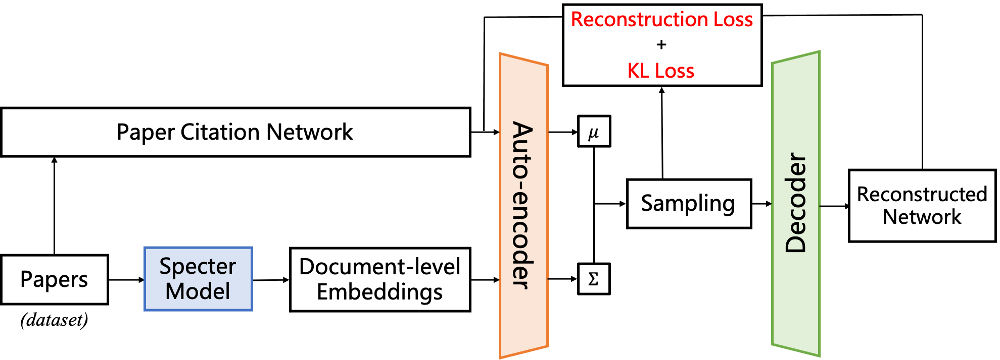
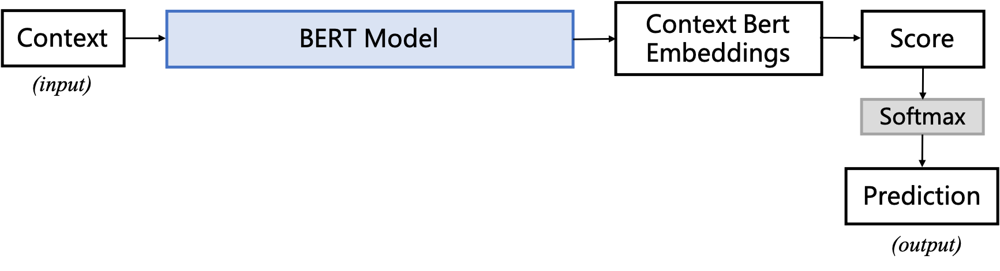
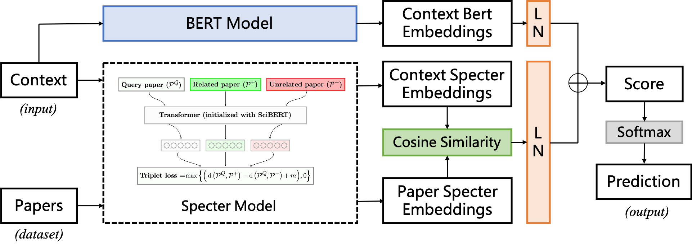

# Models

Here we illustrate the structures of the three models in our repository.

## Model 1: VGAE model for related paper recommendation (ours)

## Model 2: Bert model for context-aware citation recommendation (baseline)

## Model 3: Citation-bert model for context-aware citation recommendation (ours)

